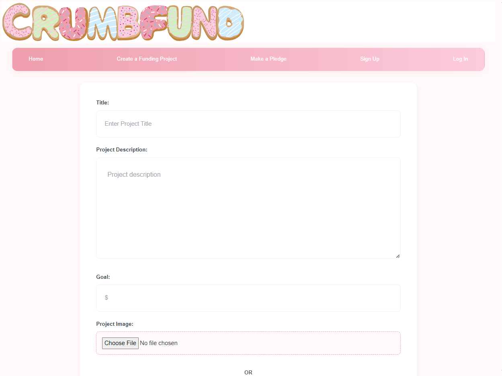
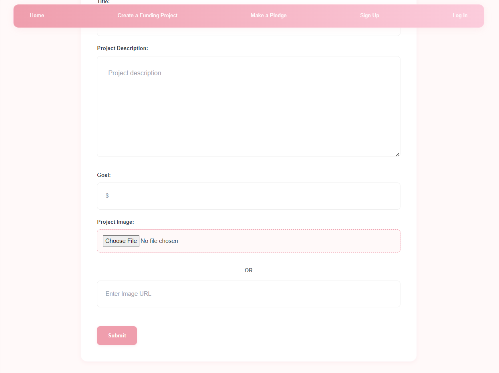

# React Project: Crowdfunding App (Part 2) 

## Project Requirements
Here's a reminder of the required features. Your crowdfunding project must:

- [x] Be separated into two distinct projects: an API built using the Django Rest Framework and a website built using React. 
- [x] Have a cool name, bonus points if it includes a pun and/or missing vowels. See https://namelix.com/ for inspiration. (Bonus Points are meaningless)
- [x] Have a clear target audience.
- [x] Have user accounts. A user should have at least the following attributes:
  - [x] Username
  - [x] Email address
  - [x] Password
- [x] Ability to create a “project” to be crowdfunded which will include at least the following attributes:
  - [x] Title
  - [x] Owner (a user)
  - [x] Description
  - [x] Image
  - [x] Target amount to fundraise
  - [x] Whether it is currently open to accepting new supporters or not
  - [x] When the project was created
- [x] Ability to “pledge” to a project. A pledge should include at least the following attributes:
  - [x] An amount
  - [x] The project the pledge is for
  - [x] The supporter/user (i.e. who created the pledge)
  - [x] Whether the pledge is anonymous or not
  - [x] A comment to go along with the pledge
- [x] Implement suitable update/delete functionality, e.g. should a project owner be allowed to update a project description?
- [x] Implement suitable permissions, e.g. who is allowed to delete a pledge?
- [x] Return the relevant status codes for both successful and unsuccessful requests to the API.
- [x] Handle failed requests gracefully (e.g. you should have a custom 404 page rather than the default error page).
- [x] Use Token Authentication.
- [x] Implement responsive design.

Screenshots
- [x] A link to the deployed project. https://comfy-trifle-07a797.netlify.app/
- [x] A screenshot of the homepage
  
- [x] A screenshot of the project creation page
  
  
- [x] A screenshot of a project with pledges
  
  
  
- [x] A screenshot of the resulting page when an unauthorized user attempts to edit a project (optional, depending on whether or not this functionality makes sense in your app!)
-It wont let a user view the edit screen if they are logged in and its not their project 